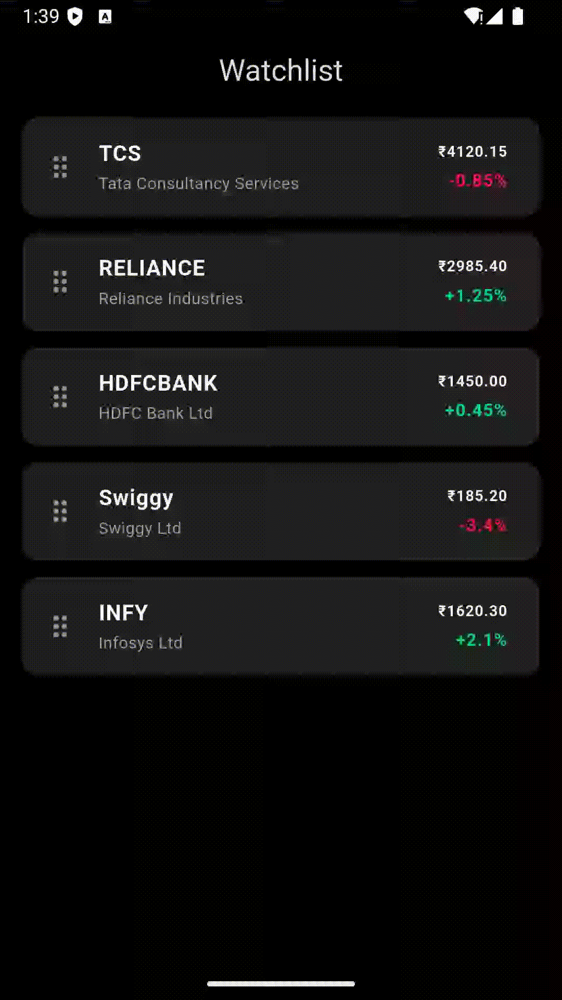

# watchlist_bloc_assignment



A professional-grade stock watchlist implementation focusing on smooth reordering logic, built with the **BLoC (Business Logic Component)** pattern.

## 🚀 Overview

This project demonstrates a real-time-ready watchlist where users can swap stock positions. The implementation focuses on state predictability, high-performance rendering, and a clean, modular code structure suitable for a production-level trading app.

## 🛠 Tech Stack

- **Framework:** Flutter
- **State Management:** [flutter_bloc](https://pub.dev/packages/flutter_bloc)
- **Data Consistency:** [equatable](https://pub.dev/packages/equatable)
- **Design System:** Material Dark Design with Trading-specific color palettes.

## 📂 Project Structure

The project follows a modular "Layered Architecture" to ensure code reusability and type safety:

```text
lib/
├── bloc/
│   ├── watchlist_bloc.dart    # Logic for loading/reordering stocks
│   ├── watchlist_event.dart   # Events: LoadWatchlist, ReorderStock
│   └── watchlist_state.dart   # States: Loading, Loaded, Error
├── models/
│   └── stock.dart             # Immutable Stock model using Equatable
├── ui/
│   └── widgets/
│       └── stock_tile.dart    # Modular, reusable UI for stock rows
└── main.dart                  # App entry, Theme config, and Watchlist Screen
```
